# CI/CD Pipeline: Deploying MERN Stack to AWS with Terraform

This article explains how to deploy a full-stack MERN application (React frontend + Express backend) to AWS EC2 using Terraform for infrastructure and GitHub Actions for CI/CD.

---

## Architecture Overview



## Key Security Design

| Component | Location | Internet Access | Accessible From |
|-----------|----------|-----------------|-----------------|
| **Frontend** | Public Subnet | Direct (via IGW) | Anyone (Port 80) |
| **Backend** | Private Subnet | Outbound only (via NAT) | Frontend only |

The backend is **never exposed to the internet**. All API requests go through the frontend, which proxies them internally.

---

# Part 1: Terraform Infrastructure

## File Structure

```
terraform-practice/
├── providers.tf      # AWS provider configuration
├── variables.tf      # Input variables
├── vpc.tf            # VPC and Internet Gateway
├── subnets.tf        # Subnets and Route Tables
├── security_groups.tf # Security Groups
├── key_pair.tf       # SSH Key Pair
├── iam.tf            # IAM User for CI/CD
├── instances.tf      # EC2 Instances
├── outputs.tf        # Output values
├── ecr-option/       # Alternative: ECR + VPC Endpoints
└── nginx-option/     # Alternative: Nginx instead of Apache
```

---

## providers.tf

```hcl
terraform {
  required_providers {
    aws = {
      source  = "hashicorp/aws"
      version = "~> 5.0"
    }
    tls = {
      source  = "hashicorp/tls"
      version = "~> 4.0"
    }
    local = {
      source  = "hashicorp/local"
      version = "~> 2.0"
    }
  }
}

# Provider Block

provider "aws" {
  profile = "default"
  region  = "us-east-1"
}
```

**Explanation:**
- **aws**: Main provider for creating AWS resources
- **tls**: Generates SSH key pairs programmatically
- **local**: Saves the private key to a local file

---

## variables.tf

```hcl
variable "ec2_instance_type" {
  description = "AWS ec2 instance type"
  type        = string
  default     = "t3.micro"
}

variable "vpc_name" {
  description = "Name of the VPC"
  type        = string
  default     = "my-vpc"
}

variable "vpc_cidr" {
  description = "vpc cidr"
  type        = string
  default     = "10.0.0.0/16"
}

variable "public_subnet_name_1" {
  description = "public subnet 1"
  type        = string
  default     = "public-subnet-1"
}

variable "public_subnet_cidr_1" {
  description = "public subnet cidr 1"
  type        = string
  default     = "10.0.0.0/24"
}

variable "private_subnet_name_1" {
  description = "private subnet 1"
  type        = string
  default     = "private-subnet-1"
}

variable "private_subnet_cidr_1" {
  description = "private subnet cidr 1"
  type        = string
  default     = "10.0.1.0/24"
}

variable "public_subnet_name_2" {
  description = "public subnet 2"
  type        = string
  default     = "public-subnet-2"
}

variable "public_subnet_cidr_2" {
  description = "public subnet cidr 2"
  type        = string
  default     = "10.0.2.0/24"
}

variable "private_subnet_name_2" {
  description = "private subnet 2"
  type        = string
  default     = "privates-subnet-2"
}

variable "private_subnet_cidr_2" {
  description = "private subnet cidr 2"
  type        = string
  default     = "10.0.3.0/24"
}

variable "internet_gw" {
  description = "internet gateway"
  type        = string
  default     = "terraforms_gw"
}

variable "ec2_ami" {
  description = "EC2 ubuntu ami"
  type        = string
  default     = "ami-0ecb62995f68bb549"
}

variable "ec2_frontend_1_name" {
  description = "EC2 frontend in zone 1"
  type        = string
  default     = "ec2_frontend_1"
}

variable "ec2_backend_1_name" {
  description = "EC2 backend in zone 1"
  type        = string
  default     = "ec2_backend_1"
}
```

**Why use variables?**
- Makes infrastructure reusable across environments
- Easy to change values without modifying code
- Can override defaults via `terraform.tfvars`

---

## vpc.tf

```hcl
# vpc 
resource "aws_vpc" "my-vpc" {
  cidr_block = var.vpc_cidr

  tags = {
    name = var.vpc_name
  }
}

# internet gateway 

resource "aws_internet_gateway" "gw" {
  vpc_id = aws_vpc.my-vpc.id

  tags = {
    Name = var.internet_gw
  }
}
```

**Explanation:**
- **VPC**: Isolated network container (10.0.0.0/16 = 65,536 IPs)
- **Internet Gateway**: Bridge between VPC and the internet

---

## subnets.tf

```hcl
# public subnet 1

resource "aws_subnet" "public_subnet_1" {
  vpc_id            = aws_vpc.my-vpc.id
  cidr_block        = var.public_subnet_cidr_1
  availability_zone = "us-east-1a"

  tags = {
    Name = var.public_subnet_name_1
  }
}

# private subnet 1

resource "aws_subnet" "private_subnet_1" {
  vpc_id            = aws_vpc.my-vpc.id
  cidr_block        = var.private_subnet_cidr_1
  availability_zone = "us-east-1a"

  tags = {
    Name = var.private_subnet_name_1
  }
}


# public subnet 2

resource "aws_subnet" "public_subnet_2" {
  vpc_id            = aws_vpc.my-vpc.id
  cidr_block        = var.public_subnet_cidr_2
  availability_zone = "us-east-1b"

  tags = {
    Name = var.public_subnet_name_2
  }
}

# private subnet 

resource "aws_subnet" "private_subnet_2" {
  vpc_id            = aws_vpc.my-vpc.id
  cidr_block        = var.private_subnet_cidr_2
  availability_zone = "us-east-1b"

  tags = {
    Name = var.private_subnet_name_2
  }
}

# rotue tables public 1 and 2

resource "aws_route_table" "public_RT_1" {
  vpc_id = aws_vpc.my-vpc.id

  route {
    cidr_block = "0.0.0.0/0"
    gateway_id = aws_internet_gateway.gw.id
  }

  tags = {
    Name = "public_RT_1"
  }
}

resource "aws_route_table" "public_RT_2" {
  vpc_id = aws_vpc.my-vpc.id

  route {
    cidr_block = "0.0.0.0/0"
    gateway_id = aws_internet_gateway.gw.id
  }

  tags = {
    Name = "public_RT_2"
  }
}

# public subnet association

resource "aws_route_table_association" "public_subnet_assoc_1" {
  subnet_id      = aws_subnet.public_subnet_1.id
  route_table_id = aws_route_table.public_RT_1.id
}

resource "aws_route_table_association" "public_subnet_assoc_2" {
  subnet_id      = aws_subnet.public_subnet_2.id
  route_table_id = aws_route_table.public_RT_2.id
}


# route tables private 1 and 2

resource "aws_route_table" "private_RT_1" {
  vpc_id = aws_vpc.my-vpc.id

  tags = {
    Name = "private_RT_1"
  }
}

resource "aws_route_table" "private_RT_2" {
  vpc_id = aws_vpc.my-vpc.id

  tags = {
    Name = "private_RT_2"
  }
}

# private subnet association

resource "aws_route_table_association" "private_subnet_assoc_1" {
  subnet_id      = aws_subnet.private_subnet_1.id
  route_table_id = aws_route_table.private_RT_1.id
}

resource "aws_route_table_association" "private_subnet_assoc_2" {
  subnet_id      = aws_subnet.private_subnet_2.id
  route_table_id = aws_route_table.private_RT_2.id
}
```

**Key Concept:**
- **Public subnet**: Route table has `0.0.0.0/0 → Internet Gateway`
- **Private subnet**: No route to internet (or via NAT for outbound only)

---

## security_groups.tf

```hcl
# security groups 

resource "aws_security_group" "web_sg" {
  name        = "web_sg"
  description = "allow traffic from anywhere to the website"
  vpc_id      = aws_vpc.my-vpc.id

  # inbound: ssh from anywhere

  ingress {
    from_port   = 22
    to_port     = 22
    protocol    = "tcp"
    cidr_blocks = ["0.0.0.0/0"]
  }

  # inbound: HTTP (80) from anywhere

  ingress {
    from_port   = 80
    to_port     = 80
    protocol    = "tcp"
    cidr_blocks = ["0.0.0.0/0"]
  }

  # Outbound: all traffic allowed

  egress {
    from_port   = 0
    to_port     = 0
    protocol    = "-1"
    cidr_blocks = ["0.0.0.0/0"]
  }

  tags = {
    name = "terraforms-Public-SG"
  }
}

resource "aws_security_group" "db_sg" {
  name        = "db_sg"
  description = "allow traffic from  the website only"
  vpc_id      = aws_vpc.my-vpc.id

  # inbound: ssh from anywhere

  ingress {
    from_port       = 22
    to_port         = 22
    protocol        = "tcp"
    security_groups = [aws_security_group.web_sg.id]
  }

  # inbound: HTTP (80) from anywhere

  ingress {
    from_port       = 3306
    to_port         = 3306
    protocol        = "tcp"
    security_groups = [aws_security_group.web_sg.id]
  }

  # Outbound: all traffic allowed

  egress {
    from_port   = 0
    to_port     = 0
    protocol    = "-1"
    cidr_blocks = ["0.0.0.0/0"]
  }

  tags = {
    name = "terraforms-Private-SG"
  }
}
```

**Security Design:**
- `web_sg`: Allows anyone to access ports 22 and 80
- `db_sg`: Only allows traffic **from instances in web_sg** - not from the internet

---

## key_pair.tf

```hcl
# generating key pairs 

resource "tls_private_key" "terraforms_key" {
  algorithm = "RSA"
  rsa_bits  = 4096
}

resource "aws_key_pair" "terraforms_key" {
  key_name   = "terraforms-key"
  public_key = tls_private_key.terraforms_key.public_key_openssh
}

resource "local_file" "ssh_key" {
  filename        = "${path.module}/terraforms-key.pem"
  content         = tls_private_key.terraforms_key.private_key_pem
  file_permission = "0400"
}
```

**Why generate keys in Terraform?**
- Automated and reproducible
- Key is saved locally for SSH access
- Can be retrieved from Terraform state if lost

---

## iam.tf

```hcl
resource "aws_iam_user" "assignment_user" {
    name = "terraform_practice_admin"

    tags = {
        Description = "Admin user for Terraform Practice Project"
    }
}

resource "aws_iam_user_policy_attachment" "admin_attach" {
  user        = aws_iam_user.assignment_user.name
  policy_arn = "arn:aws:iam::aws:policy/AdministratorAccess"
}

resource "aws_iam_access_key" "assignment_key" {
    user = aws_iam_user.assignment_user.name
}
```

**Purpose:**
- Creates an IAM user with admin access for CI/CD
- Generates access keys for GitHub Actions to use AWS CLI

---

## instances.tf

```hcl
# create EC2 instance for web 1 and web 2

resource "aws_instance" "ec2_web_1" {
  ami           = var.ec2_ami
  instance_type = var.ec2_instance_type

  subnet_id                   = aws_subnet.public_subnet_1.id
  vpc_security_group_ids      = [aws_security_group.web_sg.id]
  associate_public_ip_address = true

  key_name = aws_key_pair.terraforms_key.key_name

  # --- WEB SERVER 1 ---
  user_data = <<-EOF
    #!/bin/bash
    
    # 1. Simple Fix: Sleep 30s to let Ubuntu initialization finish
    echo "Waiting for 30 seconds to avoid lock errors..."
    sleep 30
    
    # 2. Update and Install (The -y flag is crucial)
    apt-get update -y
    apt-get install nginx -y
    
    # 3. Create the web page
    echo "<h1>Hello from Web Server 1</h1>" > /var/www/html/index.html
    
    # 4. Start Nginx
    systemctl enable nginx
    systemctl start nginx
    EOF

  tags = {
    Name = var.ec2_frontend_1_name
  }
}

resource "aws_instance" "ec2_private_1" {
  ami           = var.ec2_ami
  instance_type = var.ec2_instance_type

  subnet_id                   = aws_subnet.private_subnet_1.id
  vpc_security_group_ids      = [aws_security_group.db_sg.id]
  associate_public_ip_address = false

  key_name = aws_key_pair.terraforms_key.key_name

  user_data = <<-EOF
    #!/bin/bash
    sleep 30
    apt-get update -y
    apt-get install mysql-server -y
    systemctl enable mysql
    systemctl start mysql
    EOF

  tags = {
    Name = var.ec2_backend_1_name
  }
}
```

**Key Difference:**
- Frontend: `associate_public_ip_address = true`
- Backend: `associate_public_ip_address = false`

---

## outputs.tf

```hcl
output "access_key_id" {
  value = aws_iam_access_key.assignment_key.id
}

output "secret_access_key" {
  value     = aws_iam_access_key.assignment_key.secret
  sensitive = true
}

output "web_server_public_ip" {
  value = aws_instance.ec2_web_1.public_ip
}
```

---

## nat_gateway.tf

NAT Gateway allows instances in private subnets to access the internet for outbound traffic (like downloading Docker images, npm packages) while remaining inaccessible from the internet.

```hcl
# --- NAT Gateway for AZ 1 ---

# Elastic IP for NAT Gateway
resource "aws_eip" "nat_1" {
  domain = "vpc"

  tags = {
    Name = "NAT-EIP-AZ1"
  }
}

# NAT Gateway in public subnet
resource "aws_nat_gateway" "nat_1" {
  allocation_id = aws_eip.nat_1.id
  subnet_id     = aws_subnet.public_subnet_1.id

  tags = {
    Name = "NAT-Gateway-AZ1"
  }

  depends_on = [aws_internet_gateway.gw]
}

# --- NAT Gateway for AZ 2 (Optional - for high availability) ---

resource "aws_eip" "nat_2" {
  domain = "vpc"

  tags = {
    Name = "NAT-EIP-AZ2"
  }
}

resource "aws_nat_gateway" "nat_2" {
  allocation_id = aws_eip.nat_2.id
  subnet_id     = aws_subnet.public_subnet_2.id

  tags = {
    Name = "NAT-Gateway-AZ2"
  }

  depends_on = [aws_internet_gateway.gw]
}
```

**Key Points:**
- **Elastic IP**: Static public IP assigned to NAT Gateway
- **Location**: NAT Gateway must be in a **public subnet**
- **Cost**: ~$32/month per NAT Gateway + data processing charges

---

## Private Route Tables with NAT

Update the private route tables to route internet traffic through the NAT Gateway:

```hcl
# route tables private 1 - with NAT Gateway route
resource "aws_route_table" "private_RT_1" {
  vpc_id = aws_vpc.my-vpc.id

  route {
    cidr_block     = "0.0.0.0/0"
    nat_gateway_id = aws_nat_gateway.nat_1.id
  }

  tags = {
    Name = "private_RT_1"
  }
}

resource "aws_route_table" "private_RT_2" {
  vpc_id = aws_vpc.my-vpc.id

  route {
    cidr_block     = "0.0.0.0/0"
    nat_gateway_id = aws_nat_gateway.nat_2.id
  }

  tags = {
    Name = "private_RT_2"
  }
}
```

**Traffic Flow with NAT Gateway:**
```
Private EC2 → Private Route Table → NAT Gateway → Internet Gateway → Internet
     ↑                                    ↓
     └──────────── Response ──────────────┘
```

---

# Part 2: Dockerfiles

## Frontend Dockerfile (Apache Version)

**File: `frontend/Dockerfile`**

```dockerfile
# Stage 1: Build React App
FROM node:18-alpine AS build

WORKDIR /app

# Copy package files
COPY package*.json ./

# Install dependencies
RUN npm ci

# Copy source code
COPY . .

# Build the React app
RUN npm run build

# Stage 2: Serve with Apache
FROM httpd:alpine

# Enable required Apache modules
RUN sed -i '/LoadModule proxy_module/s/^#//g' /usr/local/apache2/conf/httpd.conf && \
    sed -i '/LoadModule proxy_http_module/s/^#//g' /usr/local/apache2/conf/httpd.conf && \
    sed -i '/LoadModule rewrite_module/s/^#//g' /usr/local/apache2/conf/httpd.conf

# Copy custom Apache config
COPY apache.conf /usr/local/apache2/conf/extra/httpd-vhosts.conf

# Enable virtual hosts config
RUN echo "Include conf/extra/httpd-vhosts.conf" >> /usr/local/apache2/conf/httpd.conf

# Copy built React app
COPY --from=build /app/build /usr/local/apache2/htdocs/

# Expose port 80
EXPOSE 80

CMD ["httpd-foreground"]
```

---

## Frontend Apache Config

**File: `frontend/apache.conf`**

```apache
<VirtualHost *:80>
    ServerName localhost
    DocumentRoot "/usr/local/apache2/htdocs"

    # Serve React static files
    <Directory "/usr/local/apache2/htdocs">
        Options Indexes FollowSymLinks
        AllowOverride All
        Require all granted
        
        # Enable React Router - redirect all requests to index.html
        RewriteEngine On
        RewriteBase /
        RewriteCond %{REQUEST_FILENAME} !-f
        RewriteCond %{REQUEST_FILENAME} !-d
        RewriteCond %{REQUEST_URI} !^/api
        RewriteRule ^ index.html [L]
    </Directory>

    # Proxy API requests to backend (private EC2)
    # The BACKEND_PRIVATE_IP will be replaced during deployment
    ProxyPreserveHost On
    ProxyPass /api/ http://BACKEND_PRIVATE_IP:5000/
    ProxyPassReverse /api/ http://BACKEND_PRIVATE_IP:5000/

    # Logging
    ErrorLog /proc/self/fd/2
    CustomLog /proc/self/fd/1 common
</VirtualHost>
```

---

## Backend Dockerfile

**File: `backend/Dockerfile`**

```dockerfile
FROM node:18-alpine

WORKDIR /app

# Copy package files
COPY package*.json ./

# Install production dependencies only
RUN npm ci --omit=dev

# Copy source code
COPY . .

# Expose backend port
EXPOSE 5000

# Start the server
CMD ["node", "index.js"]
```

---

# Part 3: GitHub Actions Workflows

## Frontend Workflow (Apache)

**File: `.github/workflows/deploy-frontend.yml`**

```yaml
name: Deploy Frontend

on:
  push:
    branches: [main]
    paths:
      - 'frontend/**'
  workflow_dispatch:

jobs:
  deploy:
    runs-on: ubuntu-latest
    
    steps:
      - name: Checkout code
        uses: actions/checkout@v4

      - name: Prepare apache config with backend IP
        working-directory: frontend
        run: |
          sed -i "s/BACKEND_PRIVATE_IP/${{ secrets.BACKEND_PRIVATE_IP }}/g" apache.conf

      - name: Copy frontend source to EC2
        uses: appleboy/scp-action@master
        with:
          host: ${{ secrets.FRONTEND_HOST }}
          username: ubuntu
          key: ${{ secrets.EC2_SSH_KEY }}
          source: "frontend/*"
          target: "app"
          strip_components: 1

      - name: Build and Deploy on EC2
        uses: appleboy/ssh-action@master
        with:
          host: ${{ secrets.FRONTEND_HOST }}
          username: ubuntu
          key: ${{ secrets.EC2_SSH_KEY }}
          command_timeout: 15m
          script: |
            cd app
            
            # Install Docker if not present
            if ! command -v docker &> /dev/null; then
              curl -fsSL https://get.docker.com -o get-docker.sh
              sudo sh get-docker.sh
              sudo usermod -aG docker ubuntu
            fi
            
            # Build and run Docker container (Dockerfile handles React build)
            sudo docker stop frontend || true
            sudo docker rm frontend || true
            sudo docker build -t frontend .
            sudo docker run -d --name frontend -p 80:80 --restart unless-stopped frontend
            
            echo "Frontend deployed successfully!"
```

---

## Backend Workflow (NAT Gateway Version)

**File: `terraform-practice/deploy-backend.yml`**

This version assumes NAT Gateway is enabled for private subnet internet access.

```yaml
name: Deploy Backend

on:
  push:
    branches: [main]
    paths:
      - 'backend/**'
  workflow_dispatch:

jobs:
  deploy:
    runs-on: ubuntu-latest
    
    steps:
      - name: Checkout code
        uses: actions/checkout@v4

      - name: Copy backend source to Private EC2 (via Jump Host)
        uses: appleboy/scp-action@master
        with:
          host: ${{ secrets.BACKEND_PRIVATE_IP }}
          username: ubuntu
          key: ${{ secrets.EC2_SSH_KEY }}
          proxy_host: ${{ secrets.FRONTEND_HOST }}
          proxy_username: ubuntu
          proxy_key: ${{ secrets.EC2_SSH_KEY }}
          source: "backend/*"
          target: "app"
          strip_components: 1

      - name: Deploy on Private Backend EC2
        uses: appleboy/ssh-action@master
        with:
          host: ${{ secrets.BACKEND_PRIVATE_IP }}
          username: ubuntu
          key: ${{ secrets.EC2_SSH_KEY }}
          proxy_host: ${{ secrets.FRONTEND_HOST }}
          proxy_username: ubuntu
          proxy_key: ${{ secrets.EC2_SSH_KEY }}
          command_timeout: 15m
          script: |
            cd app
            
            # Create .env file
            echo "MONGODB_URL=${{ secrets.MONGODB_URL }}" > .env
            echo "PORT=5000" >> .env
            
            # Install Docker if not present
            if ! command -v docker &> /dev/null; then
              curl -fsSL https://get.docker.com -o get-docker.sh
              sudo sh get-docker.sh
              sudo usermod -aG docker ubuntu
            fi
            
            # Build and run Docker container
            sudo docker stop backend || true
            sudo docker rm backend || true
            sudo docker build -t backend .
            sudo docker run -d --name backend -p 5000:5000 --env-file .env --restart unless-stopped backend
            
            echo "Backend deployed successfully!"
```

**SSH Jump Explained:**
```
GitHub Actions ──SSH──> Frontend EC2 ──SSH──> Backend EC2
                        (proxy_host)          (host)
```

The `proxy_host` parameter makes the action SSH to frontend first, then SSH from there to backend.

---

# Part 4: Alternative Options

## Alternative 1: Nginx Instead of Apache

### nginx-option/Dockerfile

```dockerfile
# Stage 1: Build React App
FROM node:18-alpine AS build

WORKDIR /app

# Copy package files
COPY package*.json ./

# Install dependencies
RUN npm ci

# Copy source code
COPY . .

# Build the React app
RUN npm run build

# Stage 2: Serve with Nginx
FROM nginx:alpine

# Copy custom nginx config
COPY nginx.conf /etc/nginx/conf.d/default.conf

# Copy built React app
COPY --from=build /app/build /usr/share/nginx/html

# Expose port 80
EXPOSE 80

CMD ["nginx", "-g", "daemon off;"]
```

### nginx-option/nginx.conf

```nginx
server {
    listen 80;
    server_name _;

    # Serve React static files
    location / {
        root /usr/share/nginx/html;
        index index.html;
        try_files $uri $uri/ /index.html;
    }

    # Proxy API requests to backend (private EC2)
    # The BACKEND_PRIVATE_IP will be replaced during deployment
    location /api/ {
        proxy_pass http://BACKEND_PRIVATE_IP:5000/;
        proxy_http_version 1.1;
        proxy_set_header Upgrade $http_upgrade;
        proxy_set_header Connection 'upgrade';
        proxy_set_header Host $host;
        proxy_set_header X-Real-IP $remote_addr;
        proxy_set_header X-Forwarded-For $proxy_add_x_forwarded_for;
        proxy_cache_bypass $http_upgrade;
    }
}
```

### nginx-option/deploy-frontend-nginx.yml

```yaml
name: Deploy Frontend (Nginx Version)

on:
  push:
    branches: [main]
    paths:
      - 'frontend/**'
  workflow_dispatch:

jobs:
  deploy:
    runs-on: ubuntu-latest
    
    steps:
      - name: Checkout code
        uses: actions/checkout@v4

      - name: Prepare nginx config with backend IP
        working-directory: frontend
        run: |
          sed -i "s/BACKEND_PRIVATE_IP/${{ secrets.BACKEND_PRIVATE_IP }}/g" nginx.conf

      - name: Copy frontend source to EC2
        uses: appleboy/scp-action@master
        with:
          host: ${{ secrets.FRONTEND_HOST }}
          username: ubuntu
          key: ${{ secrets.EC2_SSH_KEY }}
          source: "frontend/*"
          target: "app"
          strip_components: 1

      - name: Build and Deploy on EC2
        uses: appleboy/ssh-action@master
        with:
          host: ${{ secrets.FRONTEND_HOST }}
          username: ubuntu
          key: ${{ secrets.EC2_SSH_KEY }}
          command_timeout: 15m
          script: |
            cd app
            
            # Install Docker if not present
            if ! command -v docker &> /dev/null; then
              curl -fsSL https://get.docker.com -o get-docker.sh
              sudo sh get-docker.sh
              sudo usermod -aG docker ubuntu
            fi
            
            # Build and run Docker container (Dockerfile handles React build)
            sudo docker stop frontend || true
            sudo docker rm frontend || true
            sudo docker build -t frontend .
            sudo docker run -d --name frontend -p 80:80 --restart unless-stopped frontend
            
            echo "Frontend deployed successfully!"
```

---

## Alternative 2: ECR + VPC Endpoints (No NAT Gateway)

Use this if you want to avoid NAT Gateway costs (~$32/mo) but still need private subnet to pull Docker images.

### ecr-option/ecr.tf

```hcl
# --- ECR Repository for Backend ---

resource "aws_ecr_repository" "backend" {
  name                 = "mern-backend"
  image_tag_mutability = "MUTABLE"

  image_scanning_configuration {
    scan_on_push = false
  }

  tags = {
    Name = "mern-backend-ecr"
  }
}

# --- VPC Endpoints for ECR (allows private subnet to pull images WITHOUT NAT) ---

# Security group for VPC endpoints
resource "aws_security_group" "vpc_endpoints_sg" {
  name        = "vpc-endpoints-sg"
  description = "Security group for VPC endpoints"
  vpc_id      = aws_vpc.my-vpc.id

  ingress {
    from_port       = 443
    to_port         = 443
    protocol        = "tcp"
    security_groups = [aws_security_group.db_sg.id]
  }

  egress {
    from_port   = 0
    to_port     = 0
    protocol    = "-1"
    cidr_blocks = ["0.0.0.0/0"]
  }

  tags = {
    Name = "vpc-endpoints-sg"
  }
}

# ECR API endpoint
resource "aws_vpc_endpoint" "ecr_api" {
  vpc_id              = aws_vpc.my-vpc.id
  service_name        = "com.amazonaws.us-east-1.ecr.api"
  vpc_endpoint_type   = "Interface"
  subnet_ids          = [aws_subnet.private_subnet_1.id]
  security_group_ids  = [aws_security_group.vpc_endpoints_sg.id]
  private_dns_enabled = true

  tags = {
    Name = "ecr-api-endpoint"
  }
}

# ECR Docker endpoint
resource "aws_vpc_endpoint" "ecr_dkr" {
  vpc_id              = aws_vpc.my-vpc.id
  service_name        = "com.amazonaws.us-east-1.ecr.dkr"
  vpc_endpoint_type   = "Interface"
  subnet_ids          = [aws_subnet.private_subnet_1.id]
  security_group_ids  = [aws_security_group.vpc_endpoints_sg.id]
  private_dns_enabled = true

  tags = {
    Name = "ecr-dkr-endpoint"
  }
}

# S3 endpoint (ECR stores images in S3)
resource "aws_vpc_endpoint" "s3" {
  vpc_id            = aws_vpc.my-vpc.id
  service_name      = "com.amazonaws.us-east-1.s3"
  vpc_endpoint_type = "Gateway"
  route_table_ids   = [aws_route_table.private_RT_1.id]

  tags = {
    Name = "s3-endpoint"
  }
}

# --- Outputs ---

output "ecr_repository_url" {
  value = aws_ecr_repository.backend.repository_url
}
```

### ecr-option/deploy-backend-ecr.yml

```yaml
name: Deploy Backend (ECR Version)

# This workflow uses ECR + VPC Endpoints instead of NAT Gateway
# Use this if you want to avoid NAT Gateway costs (~$32/mo)
# but still need private subnet to pull Docker images

on:
  push:
    branches: [main]
    paths:
      - 'backend/**'
  workflow_dispatch:

env:
  AWS_REGION: us-east-1
  ECR_REPOSITORY: mern-backend

jobs:
  build-and-push:
    runs-on: ubuntu-latest
    outputs:
      image: ${{ steps.build-image.outputs.image }}
    
    steps:
      - name: Checkout code
        uses: actions/checkout@v4

      - name: Configure AWS credentials
        uses: aws-actions/configure-aws-credentials@v4
        with:
          aws-access-key-id: ${{ secrets.AWS_ACCESS_KEY_ID }}
          aws-secret-access-key: ${{ secrets.AWS_SECRET_ACCESS_KEY }}
          aws-region: ${{ env.AWS_REGION }}

      - name: Login to Amazon ECR
        id: login-ecr
        uses: aws-actions/amazon-ecr-login@v2

      - name: Build and push Docker image to ECR
        id: build-image
        working-directory: backend
        run: |
          IMAGE_TAG=${{ github.sha }}
          ECR_REGISTRY=${{ steps.login-ecr.outputs.registry }}
          
          docker build -t $ECR_REGISTRY/$ECR_REPOSITORY:$IMAGE_TAG .
          docker build -t $ECR_REGISTRY/$ECR_REPOSITORY:latest .
          docker push $ECR_REGISTRY/$ECR_REPOSITORY:$IMAGE_TAG
          docker push $ECR_REGISTRY/$ECR_REPOSITORY:latest
          
          echo "image=$ECR_REGISTRY/$ECR_REPOSITORY:latest" >> $GITHUB_OUTPUT

  deploy:
    runs-on: ubuntu-latest
    needs: build-and-push
    
    steps:
      - name: Deploy to Private Backend EC2
        uses: appleboy/ssh-action@master
        with:
          host: ${{ secrets.BACKEND_PRIVATE_IP }}
          username: ubuntu
          key: ${{ secrets.EC2_SSH_KEY }}
          proxy_host: ${{ secrets.FRONTEND_HOST }}
          proxy_username: ubuntu
          proxy_key: ${{ secrets.EC2_SSH_KEY }}
          command_timeout: 15m
          script: |
            # Install Docker if not present
            if ! command -v docker &> /dev/null; then
              curl -fsSL https://get.docker.com -o get-docker.sh
              sudo sh get-docker.sh
              sudo usermod -aG docker ubuntu
            fi
            
            # Login to ECR (via VPC Endpoint)
            aws ecr get-login-password --region us-east-1 | sudo docker login --username AWS --password-stdin ${{ secrets.ECR_REGISTRY }}
            
            # Create .env file
            echo "MONGODB_URL=${{ secrets.MONGODB_URL }}" > .env
            echo "PORT=5000" >> .env
            
            # Pull and run Docker container from ECR
            sudo docker stop backend || true
            sudo docker rm backend || true
            sudo docker pull ${{ needs.build-and-push.outputs.image }}
            sudo docker run -d --name backend -p 5000:5000 --env-file .env --restart unless-stopped ${{ needs.build-and-push.outputs.image }}
            
            echo "Backend deployed successfully!"
```

---

# Part 5: GitHub Secrets Configuration

## Required Secrets

| Secret | Value | Source |
|--------|-------|--------|
| `EC2_SSH_KEY` | Content of `terraforms-key.pem` | Terraform output |
| `FRONTEND_HOST` | Public IP of frontend EC2 | `terraform output web_server_public_ip` |
| `BACKEND_PRIVATE_IP` | Private IP of backend EC2 | AWS Console or state file |
| `MONGODB_URL` | MongoDB connection string | MongoDB Atlas or local |

## Additional Secrets for ECR Option

| Secret | Value | Source |
|--------|-------|--------|
| `AWS_ACCESS_KEY_ID` | IAM access key | `terraform output access_key_id` |
| `AWS_SECRET_ACCESS_KEY` | IAM secret key | `terraform output secret_access_key` |
| `ECR_REGISTRY` | ECR registry URL | `terraform output ecr_repository_url` |

---

# Part 6: Deployment Steps

## 1. Apply Terraform

```bash
cd terraform-practice
terraform init
terraform apply
```

## 2. Get Outputs

```bash
terraform output web_server_public_ip
terraform output -raw secret_access_key  # For ECR option
```

## 3. Configure GitHub Secrets

Go to GitHub → Repository → Settings → Secrets and variables → Actions

Add all required secrets from Part 5.

## 4. Push to Main

- Changes to `frontend/*` trigger frontend deployment
- Changes to `backend/*` trigger backend deployment

## 5. Access Application

Open `http://<FRONTEND_PUBLIC_IP>` in browser

---

# Summary: Option Comparison

| Aspect | NAT Gateway | ECR + VPC Endpoints |
|--------|-------------|---------------------|
| **Monthly Cost** | ~$32 | ~$14.40 |
| **Complexity** | Simple | More setup |
| **Build Location** | On EC2 | In GitHub Actions |
| **Internet for Private EC2** | Full outbound | Only AWS services |

| Frontend Server | Image Size | Memory | Config |
|-----------------|------------|--------|--------|
| **Apache** | ~60MB | Higher | More verbose |
| **Nginx** | ~23MB | Lower | Simpler |
