# CI/CD Pipeline: Deploying React + Express to AWS EC2

This article explains how to set up a complete CI/CD pipeline using GitHub Actions to deploy a full-stack application (React frontend + Express backend) to AWS EC2 servers.

## Architecture Overview



## The Deployment Flow

| Environment | Trigger | Purpose |
|-------------|---------|---------|
| **QA** | Push to any feature branch | Developers test their changes in isolation |
| **Staging** | Pull Request to `main` | Pre-production testing before merge |

---

## Deciding What to Install: The Thinking Process

Before writing your workflow, you need to understand **what runs where** and **why**.

### Step 1: Identify Your Runtime Requirements

Ask: *"What does my app need to run?"*

| Requirement | Tool | Reason |
|-------------|------|--------|
| Execute JavaScript | Node.js | Runtime for Express server |
| Keep app alive | PM2 | Process manager (auto-restart on crash) |

### Step 2: Analyze Your package.json Scripts

```json
"scripts": {
  "start": "node index.js",           // ← Runs on SERVER (needs Node.js)
  "build-react": "react-scripts build", // ← Runs in CI only (build step)
  "test": "react-scripts test"          // ← Runs in CI only (testing)
}
```

**Key insight:** Build and test happen in GitHub Actions. The server only needs to **run** the pre-built app.

### Step 3: Separate Build-time vs Runtime

| Build-time (GitHub Actions) | Runtime (EC2 Server) |
|-----------------------------|----------------------|
| All dependencies | Production dependencies only |
| React, Babel, ESLint, Jest | Express, database drivers |
| Compile, transpile, bundle | Just execute |
| `npm ci` (all deps) | `npm install --omit=dev` |

### Step 4: Map Commands to Environments

| Command | Where | Why |
|---------|-------|-----|
| `npm ci` | CI | Install all deps for building/testing |
| `npm test` | CI | Run tests before deploy |
| `npm run lint` | CI | Check code quality |
| `npm run build-react` | CI | Compile React → static files |
| `npm install --omit=dev` | Server | Only production deps needed |
| `pm2 start` | Server | Run and manage the app process |

### The Result

This thinking leads to a clear separation:


---

## QA Deployment Workflow

The QA workflow deploys your application whenever code is pushed to any branch **except** `main`. This allows developers to test their feature branches in a real environment.

### Trigger Configuration

```yaml
on:
  push:
    branches-ignore: [main]  # Triggers on ANY branch except main
  workflow_dispatch:         # Also allows manual trigger
```

### Complete Workflow Breakdown

```yaml
name: Deploy to QA

on:
  push:
    branches-ignore: [main]
  workflow_dispatch:

jobs:
  deploy:
    runs-on: ubuntu-latest
    steps:
      # 1. Checkout the code
      - uses: actions/checkout@v4

      # 2. Setup Node.js LTS
      - uses: actions/setup-node@v3
        with: { node-version: 'lts/*' }

      # 3. Build and Test
      - run: |
          npm ci                    # Clean install dependencies
          npm test                  # Run tests
          npm run build-react       # Build React frontend
          mkdir deploy_package
          cp -r build deploy_package/
          cp index.js carts.js package.json package-lock.json deploy_package/

      # 4. Upload build artifacts
      - uses: actions/upload-artifact@v4
        with: { name: app-bundle, path: deploy_package }

      # 5. Download artifacts for deployment
      - uses: actions/download-artifact@v4
        with: { name: app-bundle, path: app-bundle }

      # 6. Copy files to EC2 via SCP
      - uses: appleboy/scp-action@master
        with:
          host: 44.201.208.146
          username: ubuntu
          key: ${{ secrets.EC2_SSH_KEY }}
          source: "app-bundle/*"
          target: "app"
          strip_components: 1

      # 7. SSH into EC2 and start the app
      - uses: appleboy/ssh-action@master
        with:
          host: 44.201.208.146
          username: ubuntu
          key: ${{ secrets.EC2_SSH_KEY }}
          command_timeout: 10m
          script: |
            # Auto-install Node.js LTS if not present
            command -v node || (curl -fsSL https://deb.nodesource.com/setup_lts.x | sudo -E bash - && sudo apt-get install -y nodejs)
            
            # Allow Node.js to bind to port 80 without root
            sudo setcap 'cap_net_bind_service=+ep' $(which node)
            
            # Install PM2 if not present
            command -v pm2 || sudo npm install -g pm2
            
            cd app
            npm install --omit=dev
            pm2 restart app || pm2 start index.js --name app
```

---

## Staging Deployment Workflow

The Staging workflow is triggered when a Pull Request is opened against `main`. This ensures code is tested in a staging environment before being merged.

### Trigger Configuration

```yaml
on:
  pull_request:
    branches: [main]   # Triggers on PRs targeting main
  workflow_dispatch:   # Also allows manual trigger
```

### Additional Features

The Staging workflow includes everything from QA, plus:

1. **Linting** - Runs `npm run lint` to catch code quality issues
2. **Email Notifications** - Sends emails on build failure and deployment success

### Email Notification Steps

```yaml
# Email on Build/Test Failure
- name: Send mail on failure
  if: failure()
  uses: dawidd6/action-send-mail@v3
  with:
    server_address: smtp.gmail.com
    server_port: 465
    secure: true
    username: ${{ secrets.MAIL_USERNAME }}
    password: ${{ secrets.MAIL_PASSWORD }}
    subject: Staging Build Failed!
    from: DevOps Bot <${{ secrets.MAIL_USERNAME }}>
    to: hamzafaraz1821@gmail.com
    body: The build, test, or linting failed. Please investigate immediately.

# Email on Success
- name: Send mail on success
  if: success()
  uses: dawidd6/action-send-mail@v3
  with:
    server_address: smtp.gmail.com
    server_port: 465
    secure: true
    username: ${{ secrets.MAIL_USERNAME }}
    password: ${{ secrets.MAIL_PASSWORD }}
    subject: Staging Deployment Successful
    from: DevOps Bot <${{ secrets.MAIL_USERNAME }}>
    to: hamzafaraz1821@gmail.com
    body: |
      The changes have been deployed to Staging!
      Access the Staging Environment here:
      http://${{ secrets.STAGGING_HOST }}
```

---

## How Frontend + Backend Deploy Together

This setup deploys **both** the React frontend and Express backend to a **single EC2 instance**:



### The Express Server Structure

```javascript
// index.js - Express serves both frontend and backend
const express = require('express');
const app = express();

// Serve React static files from /build
app.use(express.static('build'));

// API routes
app.get('/api/items', (req, res) => {
  // Backend logic
});

// Fallback: serve React for all other routes
app.get('*', (req, res) => {
  res.sendFile('build/index.html');
});

app.set('port', process.env.PORT || 80);
```

### What Gets Deployed

| File/Folder | Purpose |
|-------------|---------|
| `build/` | Compiled React frontend (static files) |
| `index.js` | Express server entry point |
| `carts.js` | Backend business logic |
| `package.json` | Dependencies manifest |
| `package-lock.json` | Locked dependency versions |

---

## Key Technical Details

### Why `setcap` for Port 80?

Linux restricts ports 1-1023 to root users only. Since PM2 runs as `ubuntu` (non-root), we use:

```bash
sudo setcap 'cap_net_bind_service=+ep' $(which node)
```

This grants Node.js the **specific capability** to bind to privileged ports without running as root.

### Auto-Installing Dependencies on EC2

The workflow automatically installs Node.js and PM2 if they're not present:

```bash
# Install Node.js only if 'node' command doesn't exist
command -v node || (curl -fsSL https://deb.nodesource.com/setup_lts.x | sudo -E bash - && sudo apt-get install -y nodejs)

# Install PM2 only if 'pm2' command doesn't exist
command -v pm2 || sudo npm install -g pm2
```

This makes the deployment **self-sufficient** - a fresh EC2 instance will automatically configure itself on the first deploy.

### PM2 Process Management

```bash
pm2 restart app || pm2 start index.js --name app
```

- **First deploy:** `restart` fails (app doesn't exist), falls back to `start`
- **Subsequent deploys:** `restart` succeeds (reloads the existing app)

---

## Required GitHub Secrets

| Secret | Description |
|--------|-------------|
| `EC2_SSH_KEY` | SSH private key for QA server |
| `STAGGING_HOST` | IP/hostname of Staging server |
| `STAGGING_KEY` | SSH private key for Staging server |
| `MAIL_USERNAME` | Gmail address for notifications |
| `MAIL_PASSWORD` | Gmail app password |

---

## Summary

This CI/CD pipeline provides:

- **QA Environment** - Automatic deployment on feature branch push
- **Staging Environment** - Deployment on PR to main with email notifications
- **Self-Provisioning** - Auto-installs Node.js and PM2 on first deploy
- **Single Server** - Both React frontend and Express backend on one EC2
- **Zero Downtime** - PM2 manages graceful restarts
